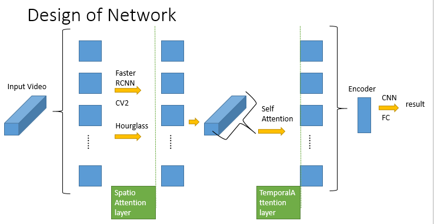

# Sign-Language-Recognition
Sign Language Recognition
## Spatial Attention
Hourglass Neural Network is popular in object detection and works well. The first step of our work is to apply such network to mask the area of hands and faces on the image, which makes the latter network could focus more on those useful information.

  
  
  

## Temoral Attention
Not all frames in a video is useful for sign language recognition.
Using self-attention machenism to get a weighted average of features from all frames and make classification depending on it.

 

## Dataset
http://vlm1.uta.edu/~athitsos/asl_lexicon/
